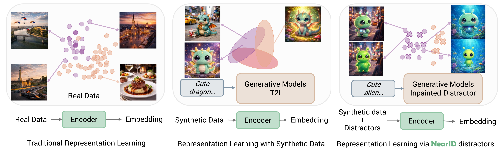

# NearID: Identity Representation Learning via Near-identity Distractors

<!-- TODO: uncomment when arxiv is available
[](https://arxiv.org/abs/XXXX.XXXXX)
-->
[](https://huggingface.co/Aleksandar/nearid-siglip2)
[](https://huggingface.co/datasets/Aleksandar/NearID)
[](LICENSE)
[](https://www.python.org/)
[](https://gorluxor.github.io/NearID)
[](https://www.kaust.edu.sa/)
[](https://research.snap.com/)

<p align="center">
  
</p>

NearID produces **identity-aware image embeddings** that remain stable across background and context changes while correctly rejecting *near-identity distractors* — visually similar but different instances placed in the same context. It is designed for evaluating identity preservation in personalized image generation.

## Quick Start

```bash
pip install nearid
# or install from source:
# pip install -e .
```

```python
from transformers import AutoModel, AutoImageProcessor
from PIL import Image

model = AutoModel.from_pretrained("Aleksandar/nearid-siglip2", trust_remote_code=True)
processor = AutoImageProcessor.from_pretrained("Aleksandar/nearid-siglip2")

inputs = processor(images=Image.open("photo.jpg"), return_tensors="pt")
embedding = model.get_image_features(**inputs)  # [1, 1152], L2-normalised
```

## Results

### Near-Identity Discrimination & Alignment (Table 1)

| Scoring Model | NearID SSR | NearID PA | MTG MO | MTG MOpair | MTG SSR | MTG PA | DB++ MH |
|---|---|---|---|---|---|---|---|
| CLIP ViT-L/14 | 10.31 | 20.92 | 0.239 | 0.484 | 0.0 | 0.0 | 0.493 |
| DINOv2 ViT-L/14 | 20.43 | 34.55 | 0.324 | **0.519** | 0.0 | 0.0 | 0.492 |
| SigLIP2 (backbone) | 30.74 | 48.81 | 0.180 | 0.366 | 0.0 | 0.0 | 0.516 |
| VSM | 32.13 | 46.70 | 0.394 | 0.445 | 7.0 | 24.5 | 0.190 |
| **NearID (Ours)** | **99.17** | **99.71** | **0.465** | 0.486 | **35.0** | **46.5** | **0.545** |

SSR and PA are averaged across seven inpainting settings (three excluded from training). MO/MOpair = metric-to-oracle correlation; MH = metric-to-human correlation (Fisher-z averaged).

## Installation

**Inference only:**
```bash
pip install -e .
```

**Training & evaluation:**
```bash
conda env create -f environment.yaml
conda activate nearid
pip install -e ".[all]"
```

## Usage

### Pairwise Similarity

```python
import torch

emb_a = model.get_image_features(**processor(images=img_a, return_tensors="pt"))
emb_b = model.get_image_features(**processor(images=img_b, return_tensors="pt"))

similarity = (emb_a @ emb_b.T).item()  # cosine similarity
```

### Batch Inference

```python
images = [Image.open(p) for p in image_paths]
inputs = processor(images=images, return_tensors="pt", padding=True)
embeddings = model.get_image_features(**inputs)  # [B, 1152]

sim_matrix = embeddings @ embeddings.T
```

## Architecture

| Property | Value |
|----------|-------|
| Base model | `google/siglip2-so400m-patch14-384` |
| Backbone | SigLIP2 SO400M ViT/14 @ 384px (**frozen**) |
| Pooling head | Multi-head Attention Pooling (MAP), initialised from SigLIP2 (**trained**) |
| Embedding dim | 1152 |
| Total parameters | ~428M |
| Trainable parameters | ~15M (head-only) |
| Input resolution | 384 x 384 |

## Training

Train with the NearID loss (extended InfoNCE with near-identity distractor ranking):

```bash
accelerate launch -m training.train \
    --loss_config "infonce_ext:1.0" \
    --head_type map --head_out_dim 1152 \
    --lr 1e-4 --epochs 11 --data.batch_size 128
```

See [docs/TRAINING.md](docs/TRAINING.md) for the full guide.

## Evaluation

```bash
# Step 1: compute similarities
python -m evaluation.sim_test \
    --mode fullneg --model "Aleksandar/nearid-siglip2" \
    --ds "Aleksandar/NearID" --ds_neg "path/to/negatives" \
    --output_folder runs/evals/ --batch_size 64

# Step 2: aggregate tables
python -m evaluation.gen_tables --root runs/evals/ --overlap primary
```

See [docs/EVALUATION.md](docs/EVALUATION.md) for the full guide.

## Datasets

The NearID benchmark consists of multi-view positives and near-identity distractors generated by an ensemble of inpainting pipelines. All datasets are released under [CC-BY-4.0](https://creativecommons.org/licenses/by/4.0/).

| Dataset | Description | HuggingFace |
|---|---|---|
| **NearID** | Multi-view positives (anchor + positive views) | [`Aleksandar/NearID`](https://huggingface.co/datasets/Aleksandar/NearID) |
| NearID-Flux | Near-identity distractors via FLUX.1 | [`Aleksandar/NearID-Flux`](https://huggingface.co/datasets/Aleksandar/NearID-Flux) |
| NearID-Flux_1024 | FLUX.1 @ 1024px | [`Aleksandar/NearID-Flux_1024`](https://huggingface.co/datasets/Aleksandar/NearID-Flux_1024) |
| NearID-FluxC | FLUX.1 Canny-guided | [`Aleksandar/NearID-FluxC`](https://huggingface.co/datasets/Aleksandar/NearID-FluxC) |
| NearID-FluxC_1024 | FLUX.1 Canny-guided @ 1024px | [`Aleksandar/NearID-FluxC_1024`](https://huggingface.co/datasets/Aleksandar/NearID-FluxC_1024) |
| NearID-PowerPaint | PowerPaint inpainting | [`Aleksandar/NearID-PowerPaint`](https://huggingface.co/datasets/Aleksandar/NearID-PowerPaint) |
| NearID-Qwen | Qwen-based inpainting | [`Aleksandar/NearID-Qwen`](https://huggingface.co/datasets/Aleksandar/NearID-Qwen) |
| NearID-Qwen_1328 | Qwen-based @ 1328px | [`Aleksandar/NearID-Qwen_1328`](https://huggingface.co/datasets/Aleksandar/NearID-Qwen_1328) |
| NearID-SDXL | Stable Diffusion XL inpainting | [`Aleksandar/NearID-SDXL`](https://huggingface.co/datasets/Aleksandar/NearID-SDXL) |
| NearID-SDXL_1024 | SDXL @ 1024px | [`Aleksandar/NearID-SDXL_1024`](https://huggingface.co/datasets/Aleksandar/NearID-SDXL_1024) |

```python
from datasets import load_dataset

positives = load_dataset("Aleksandar/NearID")
negatives = load_dataset("Aleksandar/NearID-Flux")
```

## Model Zoo

| Model | HuggingFace Hub | SSR | PA | MH |
|-------|----------------|-----|----|----|
| NearID (SigLIP2 + MAP) | [`Aleksandar/nearid-siglip2`](https://huggingface.co/Aleksandar/nearid-siglip2) | 99.17 | 99.71 | 0.545 |

## Citation

```bibtex
@article{cvejic2026nearid,
  title={NearID: Identity Representation Learning via Near-identity Distractors},
  author={Cvejic, Aleksandar and Abdal, Rameen and Eldesokey, Abdelrahman and Ghanem, Bernard and Wonka, Peter},
  journal={arXiv preprint arXiv:2604.01973},
  year={2026}
}
```

## Acknowledgements

This work was supported by King Abdullah University of Science and Technology (KAUST) and Snap Inc.

## License

- **Code & model weights:** Apache License 2.0. See [LICENSE](LICENSE).
- **Datasets:** [CC-BY-4.0](https://creativecommons.org/licenses/by/4.0/). Derived from [SynCD](https://github.com/nupurkmr9/syncd) (MIT License).
